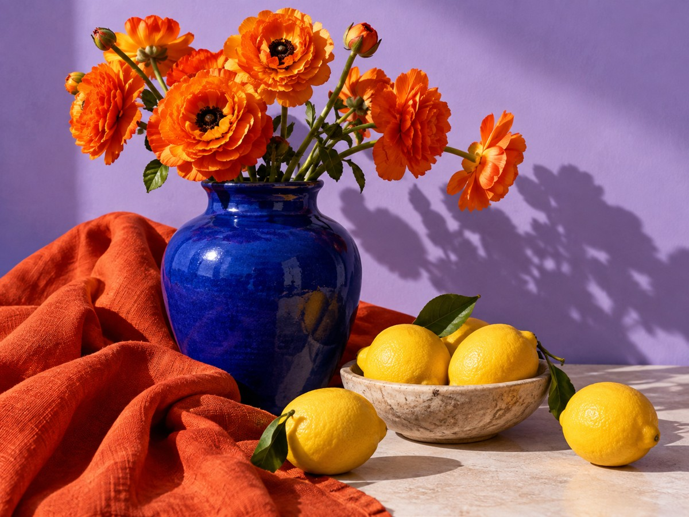
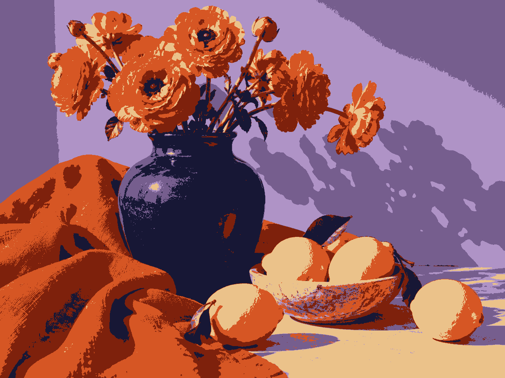
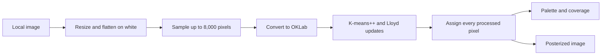

# Chroma Lab

**Discover the colors in a photo. Turn them into something useful.**

**[Try the live demo](https://danyishere12.github.io/chroma-lab/)** — open it in your desktop browser, choose a photo, and export your palette. No installation or account required.

A local image-to-palette studio built with vanilla JavaScript, Web Workers, and K-means++ clustering in OKLab color space. Drop in an image, explore a posterized reconstruction, and export a palette for your next design.

<table>
  <tr><th>Original sample</th><th>Six-color reconstruction</th></tr>
  <tr>
    <td></td>
    <td></td>
  </tr>
</table>

*Actual output from the included Python companion. The sample image is AI-generated. The browser uses the same method with a different seeded random generator, so its palette can differ.*

## Try it locally

With Python 3 installed, run this from the repository root:

```sh
python3 -m http.server 8000 --bind 127.0.0.1
```

Open [localhost:8000](http://localhost:8000). On Windows, use `py` instead of `python3` if needed. No build, npm install, API key, or backend is required. Use an HTTP server: opening `index.html` directly does not reliably support module workers.

1. Open or drop a JPEG, PNG, WebP, or AVIF image, up to 25 MB.
2. Choose 2–12 colors and select **Discover colors**.
3. Drag across the image to compare, use the keyboard-accessible slider, or switch to Original or Result.
4. Click a swatch to copy its HEX code. Export CSS variables, a palette SVG, structured JSON, or a posterized PNG.

All image processing runs on your device. The app uses local assets and system fonts, with no analytics, external font requests, or image uploads. Refreshing clears the loaded image.

## Why this project

Chroma Lab connects a machine-learning algorithm to a practical design workflow. The implementation includes:

- **K-means++ from scratch:** distance-weighted initialization, Lloyd's updates, convergence checks, and deterministic sampling.
- **Perceptual color processing:** sRGB ↔ OKLab conversion, gamut clipping, and duplicate-color merging.
- **Responsive processing:** a module worker handles clustering and reconstruction, with transferable pixel buffers and progress messages.
- **Careful interaction states:** newer uploads cancel older jobs; unreadable uploads preserve the previous usable image; failed analyses clear outdated results.
- **Usable outputs:** coverage percentages come from all processed pixels, and JSON exports record the settings of the completed analysis.
- **Independent Python implementation:** NumPy and Pillow provide a second implementation, including EXIF orientation and transparency handling.

## How it works



Images are resized to a maximum 1,200-pixel edge. Larger images use fixed-seed uniform sampling with replacement; smaller images use every pixel. Clustering stops when squared center movement is below `1e-9`, or after 30 rounds. Each processed pixel is then assigned to its nearest center. Centers are converted to 8-bit sRGB, duplicate colors are merged, and unused centers are removed.

**Engineering tradeoffs**

| Decision | Benefit | Tradeoff |
| --- | --- | --- |
| OKLab distance | Color distances better reflect perception than raw RGB | Conversion adds work; it does not model image content |
| 8,000 samples / 30 rounds | Bounds clustering work | Rare colors may be missed; the result is a local optimum |
| 1,200-pixel maximum edge | Limits processing and export size | Downloads are not full-resolution originals |
| Web Worker | Keeps pixel computation off the UI thread | Requires a browser with module worker support |
| Fixed random seeds | Reproducibility within each implementation | JavaScript and NumPy palettes need not match exactly |

A requested color count is a maximum: a solid image can produce one color. Coverage is the fraction of image pixels, not model confidence. This is color quantization, not object recognition or semantic segmentation. Decoding and rendering can also vary slightly between browsers.

## Python companion

Use Python 3.10 or newer. The Python CLI is separate from the web app; the browser does not execute Python.

```sh
python3 -m venv .venv
source .venv/bin/activate
# Windows: .venv\Scripts\activate
python -m pip install -r python/requirements.txt
python python/palette.py assets/sample.jpg --colors 6 --output output
```

This writes `posterized.png`, `palette.json`, and `palette.css`. The JSON records dimensions, requested color count, clustering rounds, sample size, and each color's HEX code, pixel count, and share. Example outputs are checked into [`docs/example/`](docs/example/).

## Tests

The web app has zero third-party JavaScript dependencies. Node.js 22+ is needed only for development checks:

```sh
npm run check
npm test
python -m unittest discover -s python -p 'test_*.py'
```

Install the Python requirements first. Tests cover color round trips, uniform images, real pixel coverage, reproducibility, sample limits, invalid inputs, export serialization, and the worker's transfer/progress/error protocol. Python tests also cover transparency, EXIF orientation, and resizing. GitHub Actions runs both suites on pushes and pull requests. These are automated logic tests, not a cross-browser UI test suite.

## Publish on GitHub Pages

1. Create a repository named `chroma-lab` and upload this folder's **contents**, keeping `index.html` at the repository root. Include `.github/`, `.gitignore`, and `.nojekyll`; these may be hidden in your file manager.
2. In the repository, open **Settings → Pages**.
3. Under **Build and deployment**, choose **Deploy from a branch**, select your uploaded branch (usually `main`) and **/ (root)**, then save.
4. When deployment finishes, use the URL shown by GitHub Pages. Add it to the repository's **About → Website** field.

See [GitHub's publishing-source guide](https://docs.github.com/en/pages/getting-started-with-github-pages/configuring-a-publishing-source-for-your-github-pages-site). All app paths are relative, so the project can run beneath a repository subpath. No custom build workflow is necessary; the included Actions workflow validates the code.

**Suggested repository description:** Local image palette extraction using K-means++ in OKLab, with an interactive JavaScript studio and Python companion.

**Suggested topics:** `javascript`, `python`, `kmeans`, `oklab`, `image-processing`, `color-palette`, `web-workers`

## Source map

| File | Responsibility |
| --- | --- |
| [`index.html`](index.html), [`style.css`](style.css) | Accessible controls and responsive studio layout |
| [`app.js`](app.js) | Image loading, state, comparison, clipboard, and downloads |
| [`worker.js`](worker.js) | Worker transport and progress/error messages |
| [`kmeans.mjs`](kmeans.mjs) | Pure color conversion and clustering functions |
| [`exports.mjs`](exports.mjs) | CSS, SVG, and JSON serialization |
| [`python/palette.py`](python/palette.py) | Independent NumPy/Pillow CLI |
| [`tests/`](tests/), [`python/test_palette.py`](python/test_palette.py) | JavaScript and Python regression tests |
| [`.github/workflows/checks.yml`](.github/workflows/checks.yml) | Continuous integration |

## References and provenance

- [OKLab by Björn Ottosson](https://bottosson.github.io/posts/oklab/) — perceptual color space and conversion matrices.
- [K-means++ by Arthur and Vassilvitskii](https://theory.stanford.edu/~sergei/papers/kMeansPP-soda.pdf) — distance-weighted seeding.

The initial implementation and sample image were created with AI assistance. This project is intended to be understood, tested, and extended; its source exposes the full algorithm rather than calling an external ML service.
